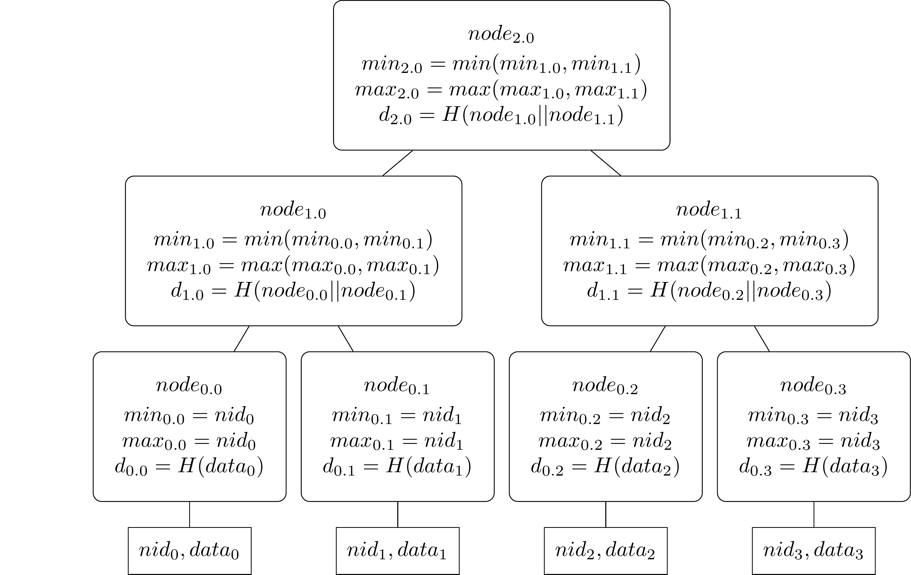

# Namespaced Merkle Tree (NMT)

[](https://pkg.go.dev/github.com/lazyledger/nmt)


A Namespaced Merkle Tree is
> [...] an ordered Merkle tree that uses a modified hash function
  so that each node in the tree includes the range of
  namespaces of the messages in all of the descendants
  of each node. The leafs in the tree are ordered by the
  namespace identifiers of the messages.
  In a namespaced Merkle tree, each non-leaf node in
  the tree contains the lowest and highest namespace
  identifiers found in all the leaf nodes that are descendants of the non-leaf node, in addition to the hash of
  the concatenation of the children of the node. This
  enables Merkle inclusion proofs to be created that prove to a verifier that all the elements of the tree for
  a specific namespace have been included in a Merkle
  inclusion proof.

The concept was first introduced by [@musalbas] in the LazyLedger [academic paper].

## Example
```go
package main

import (
    "crypto/sha256"
    "fmt"

    "github.com/lazyledger/nmt"
    "github.com/lazyledger/nmt/namespace"
)

func main() {
    // the tree will use this namespace size
    nidSize := 1
    // the leaves that will be pushed
    data := []namespace.PrefixedData{
      namespace.PrefixedDataFrom(namespace.ID{0}, []byte("leaf_0")),
      namespace.PrefixedDataFrom(namespace.ID{0}, []byte("leaf_1")),
      namespace.PrefixedDataFrom(namespace.ID{1}, []byte("leaf_2")),
      namespace.PrefixedDataFrom(namespace.ID{1}, []byte("leaf_3")),
    }
    // Init a tree with the namespace size as well as
    // the underlying hash function:
    tree := New(sha256.New(), NamespaceIDSize(nidSize))
    for _, d := range data {
      if err := tree.Push(d.NamespaceID(), d.Data()); err != nil {
        panic("unexpected error")
      }
    }
    // compute the root
    root := tree.Root()
    // the root's min/max namespace is the min and max namespace of all leaves:
    if root.Min().Equal(namespace.ID{0}) {
      fmt.Printf("Min namespace: %x\n", root.Min())
    }
    if root.Max().Equal(namespace.ID{1}) {
      fmt.Printf("Max namespace: %x\n", root.Max())
    }
  
    // compute proof for namespace 0:
    proof, err := tree.ProveNamespace(namespace.ID{0})
    if err != nil {
      panic("unexpected error")
    }
  
    // verify proof using the root and the leaves of namespace 0:
    leafs := [][]byte{
      append(namespace.ID{0}, []byte("leaf_0")...),
      append(namespace.ID{0}, []byte("leaf_1")...),
    }
  
    if proof.VerifyNamespace(sha256.New(), namespace.ID{0}, leafs, root) {
      fmt.Printf("Successfully verified namespace: %x\n", namespace.ID{0})
    }
  
    if proof.VerifyNamespace(sha256.New(), namespace.ID{2}, leafs, root) {
      panic(fmt.Sprintf("Proof for namespace %x, passed for namespace: %x\n", namespace.ID{0}, namespace.ID{2}))
    }
}
```
The above will create a Namespaced merkle tree with four leafs which looks like this:


 
Where `nid_0 = nid_1 = 0` and `nid_2 = nid_3 = 1` and `data_i = "leaf_i"` for `i = 0,...,3`.  
## Related

This implementation (currently) uses NebulousLabs' [merkletree][NebulousLabs'] implementation
and was heavily inspired by the initial implementation in the LazyLedger [prototype].


<!--- TODO references --->
[academic paper]: https://arxiv.org/abs/1905.09274
[@musalbas]: https://github.com/musalbas

[prototype]: https://github.com/lazyledger/lazyledger-prototype
[NebulousLabs']: https://gitlab.com/NebulousLabs/merkletree
[trillian]: https://github.com/google/trillian
[`LogHasher`]: https://github.com/google/trillian/blob/7502e99bb92ecf0ec8add958889c751f2cfc7f59/merkle/hashers/tree_hasher.go#L23-L34
 

